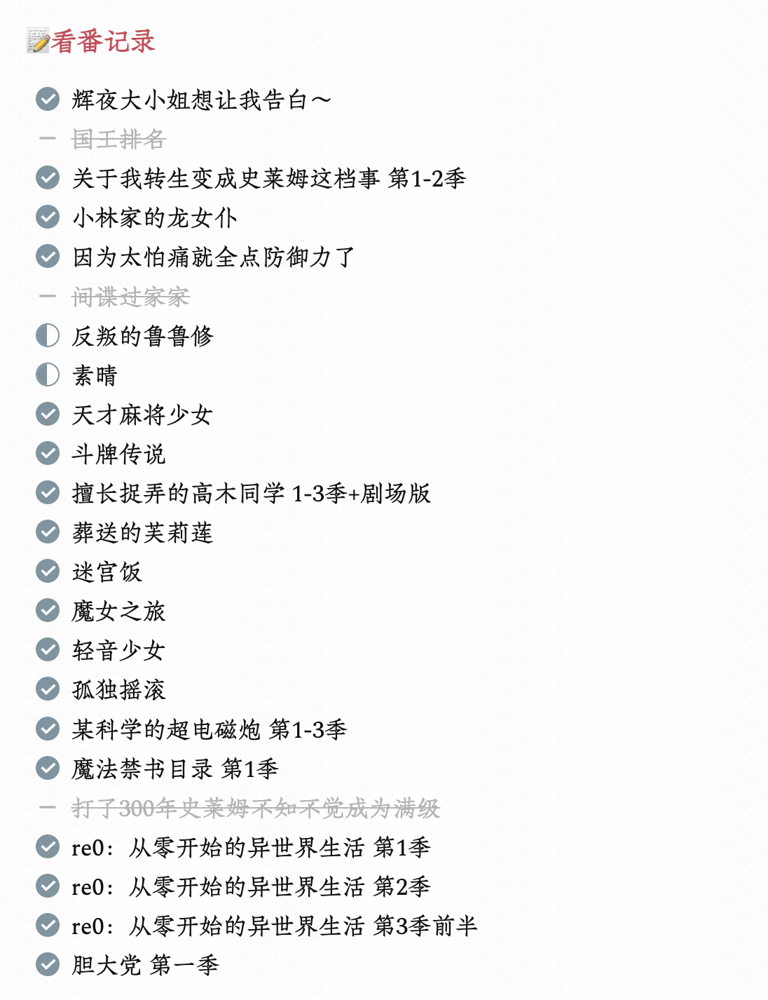
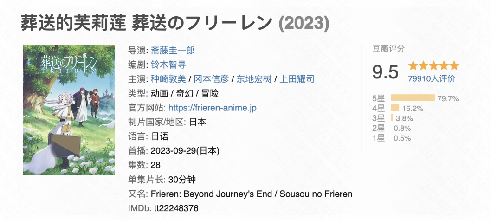

很早就在思考年终总结这件事，但一直拖着没有写。对我来说，年终总结就像一个命题作文，有既定的内容范围，无非是这一年做了什么、看到了什么、想到了什么，这种隐性的约束感让我有些难以放手去写。所以，本篇大约只能当做是Done List类似的东西，不存在什么“反思复盘”的意义，只是记录。

## 学生时代的最后一年

## 勉强算是二次元

### 看番记录
认识zsy之后一起吃了很多顿饭，也就着饭看了一些番，跨过一千天之后终于能在刷b站的时候勉强加入一些二次元的话题^ ^

因为并没有完全按时间记录看番顺序，我这个烂记忆力甚至已经分不清哪些是今年看的了，所以决定在此处全部贴出来，明年再写年终总结的时候就能分清了（真是天才的想法）！

### 今年最喜欢的番Top3（不分先后）：
其实今年看的番整体质量都挺好的，非要挑出前三名的话是以下三位～
——提一嘴，超炮没有入选的原因是本人对上条当麻以及御坂美琴的伟光正好人脾气有些喜欢不起来（纯个人想法）；《胆大党》没有入选的原因是故事还没怎么展开就结束了（意思是快点把第二季给我端上来！）

> 盖将自其变者而观之，则天地曾不能以一瞬；自其不变者而观之，则物与我皆无尽也。

