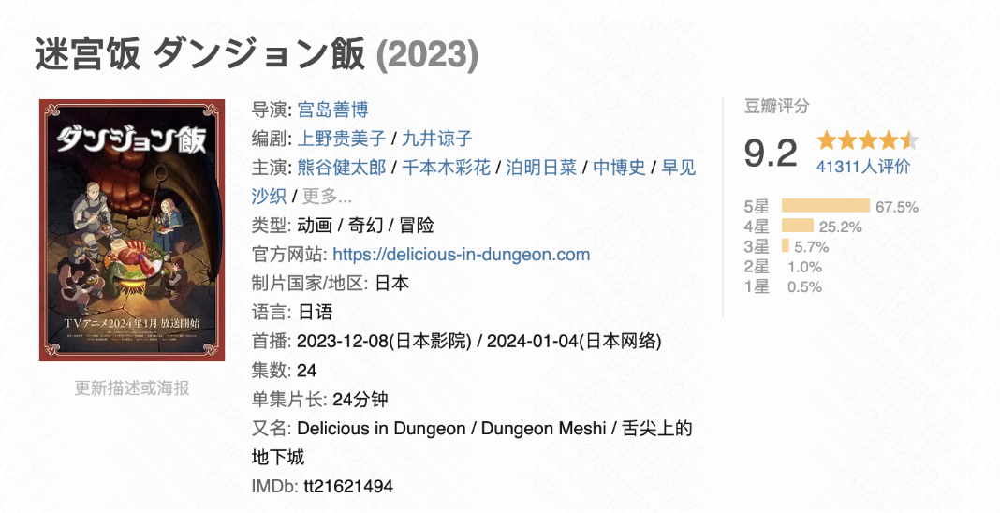
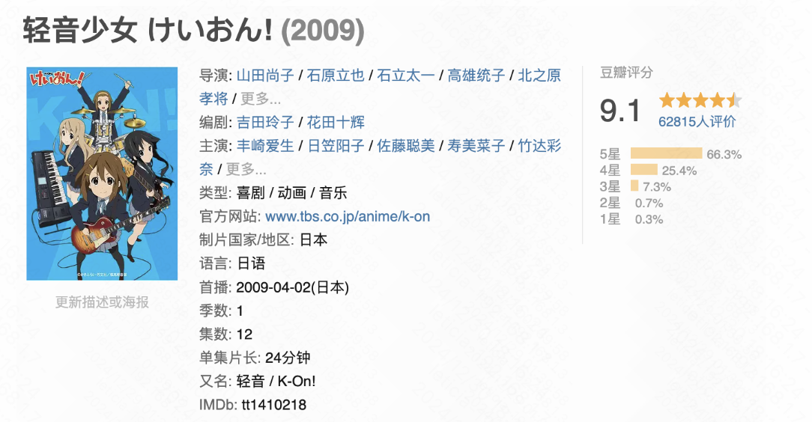

早就开始琢磨年终总结，但一直拖着没写。说实话，我并不太喜欢写这种东西(当然很可能是因为本人稀巴烂的长文本写作能力)。对我而言，年终总结就像一篇命题作文，有固定的内容范围：无非是回顾这一年做了什么、见识了什么、想到了什么。正因为如此，这篇文字也更像是一份 Done List，仅仅是记录而已，谈不上“反思复盘”。

### 学生时代的最后一年

严谨来说应该是“学生时代最后一个完整年”，尽管研一的课程结课后我就几乎不再回到校园，身份认知上总还是保持着学生。  
被动或主动，今年最大的成就毫无疑问是找工。从3月到5月，从8月到12月，这么一算居然一年12个月里有8个月都在紧锣密鼓地找工作，中间交叠了三段合计9个月的实习。

---
### 勉强算是二次元

#### 看番记录
认识zsy之后一起吃了很多顿饭，也就着饭看了一些番，跨过一千天之后终于能在刷b站的时候勉强加入一些二次元的话题^ ^

因为并没有完全按时间记录看番顺序，我这个烂记忆力甚至已经分不清哪些是今年看的了，所以决定在此处全部贴出来，明年再写年终总结的时候就能分清了（真是天才的想法）！

#### 今年最喜欢的番Top3（不分先后）：
其实今年看的番整体质量都挺好的，非要挑出前三名的话是以下三位～

——提一嘴，超炮没有入选的原因是本人对上条当麻以及御坂美琴的伟光正好人脾气有些喜欢不起来（纯个人想法）；《胆大党》没有入选的原因是故事还没怎么展开就结束了（意思是快点把第二季给我端上来！），最近在看原版漫画，是一部非常有表现力和想象力的作品~

> 盖将自其变者而观之，则天地曾不能以一瞬；自其不变者而观之，则物与我皆无尽也。

> 宏大又精细的世界观，非常有意思的群像塑造。蛋饺梅西~

> 把两季动漫和剧场版都看完了，很难想象是这么多年以前的番，放到现在来看也依旧能打。很喜欢这种淡淡的叙事，慢慢看完两季，仿佛自己也跟着她们一起度过了三年的高中时光，看到第二季结尾五个女孩在活动室里肩并肩睡着的时候忍不住悄悄落泪。  
> 故事停在这里其实也挺好，我自私地这么想。

#### 这些也算二次元吗？
——意思是电影电视剧纪录片，暂且归在这个标题下。

**🏆今年最喜欢的电视剧：**   

虽然很早就听过这部，今年才终于看完……

**🏆今年最喜欢的电影：**   

惭愧地说，今年没怎么看电影。和树洞随机捞的陌生女孩一起去看了这部，出乎意料地喜欢。观影途中数次流泪，但看完却不觉得悲伤。最喜欢的片段是小叶给小孩放声音素材那段蒙太奇，宏大的词汇和日常的场景交织，哇，原来生活里的琐碎也可以这么理解。

另外，小叶那么美那么好，所有人都应该爱她！
