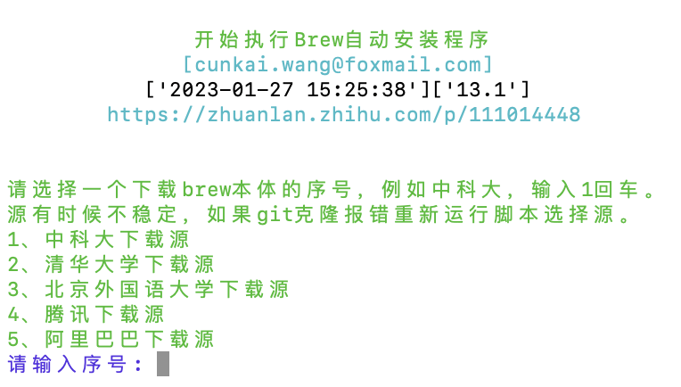
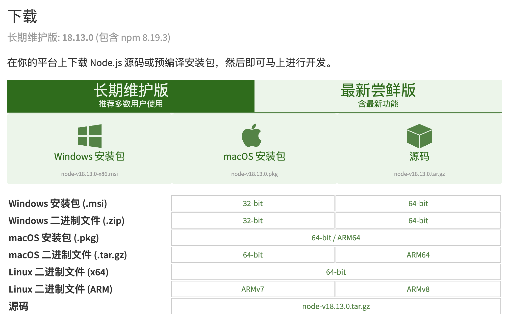
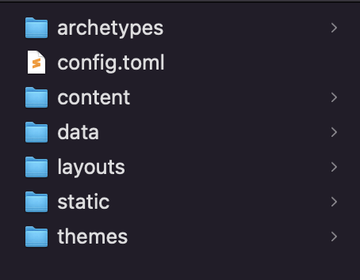

## 写在前面
每次看到别人有自己的漂亮博客就好羡慕好羡慕，但秉持着“只要手头上还有比这更容易做的事就不轻易动手”的原则，一直拖拖拖拖了一整个2022……于是在2023年1月1号这一天，博主抛下了难产的年终总结以及难产的毕设中期报告，撸起袖子开始捣鼓了！  
- 搭建过程中遇到了很多奇怪的问题（推翻重建不说，甚至更换了几次主题），在此特别感谢：
  - [一起动手搭建个人博客吧](https://mantyke.icu/posts/2021/hugo-build-blog/)对静态博客的详尽介绍
  - [hugo博客搭建｜PaperMod主题](https://www.sulvblog.cn/posts/blog/)让我对hugo主题有了更深的理解（当然也跟着这篇博文尝试过大刀阔斧的改建……）
  - 换到luna主题主要参考了[Hugo Luna｜换上了新主题，一边装修一边相声](https://gregueria.icu/posts/hugo-luna/)
  - 以及好朋友写的[国庆不出门宅女美丽新家装潢一站式笔记](https://www.houdini.eu.org/%E5%9B%BD%E5%BA%86%E4%B8%8D%E5%87%BA%E9%97%A8%E5%AE%85%E5%A5%B3%E7%BE%8E%E4%B8%BD%E6%96%B0%E5%AE%B6%E8%A3%85%E6%BD%A2%E4%B8%80%E7%AB%99%E5%BC%8F%E7%AC%94%E8%AE%B0.html/)(真的太感谢这篇！)


设备与测试环境：    

## ToDo List

- [x] **普通博客文章插入图片默认铺满宽度，无法调整大小（但在gallery模式就可以）**  
  - 2023-01-09更新：解决啦！实在憋不住去GitHub上给作者留了个issue，没想到很快就得到了[回复](https://github.com/Ice-Hazymoon/hugo-theme-luna/issues/60)！
  - 具体方法是在`/assets/sass/typo.scss`中 
  ```scss
    //找到第281行： 
    img:not(.link-card-img), 

    //将上面这行删去改为
    img {
        @apply my-4 rounded dark:border-darkBorder w-auto mx-auto max-w-[60%] //这里具体大小可以自己调整
    }
  ```
- [x] **想要一个评论系统><**  
  - 2023-01-27更新：解决啦！赞美小鱼！具体见下文。




## 前置准备
### 1. 安装Homebrew和Git
> 以下是基于Mac(M1)的安装方法，其他操作系统可根据[homebrew官网教程](https://brew.sh/index_zh-cn)进行安装。

首先需要在mac上打开“终端”（英文版系统叫Terminal，不会打开的朋友可以看[这里](https://zhuanlan.zhihu.com/p/369615135))。随后在终端命令行窗口输入官网提供的安装命令。
```
/bin/bash -c "$(curl -fsSL https://raw.githubusercontent.com/Homebrew/install/HEAD/install.sh)"
```
但是由于GFW的存在，如果没连VPN，可能会报错
`curl: (7) Failed to connect to raw.githubusercontent.com port 443: Connection refused`。
搜索后发现gitee上的大佬写了自动安装脚本，只需在终端内输入
```
/bin/zsh -c "$(curl -fsSL https://gitee.com/cunkai/HomebrewCN/raw/master/Homebrew.sh)"
```
回车执行指令后，出现下图，根据提示选择镜像下载即可。  

这里要注意的是，在安装homebrew的过程中，如果之前没有安装过git，系统会终止homebrew安装并弹出git安装提示。点击“安装”，耐心等待git安装完成后再次输入homebrew安装指令，重复以上步骤即可。  
> 验证安装是否成功：安装脚本执行完成后，重启终端，分别输入`brew -v`以及`git version`验证，输出版本号则说明homebrew和git已安装成功。

***
### 2. 安装Hugo
直接在终端内输入`brew install hugo`，等待安装完成。随后输入`hugo version`，若出现版本信息则表示安装成功。

***
### 3. 配置SSH

其实博主本人并不明确地知道这个步骤是否有用，因为在搭建过程中出了太多奇怪的问题，推倒重建过好几次，但这一步并没有重建。


SSH 密钥用来链接本地和 Git 服务器，它成对生成，分别是” 公钥 “和” 私钥 “，我们将其中的” 公钥 “保存到 Git 仓库后，就可以在电脑上向这个 Git 仓库提交代码。  
Github Docs有一篇讲SSH连接的[中文文档](https://docs.github.com/zh/authentication/connecting-to-github-with-ssh/generating-a-new-ssh-key-and-adding-it-to-the-ssh-agent)，可以辅助参考。  
#### 查看是否已配置过SSH（该步可省去）
打开终端，在默认目录输入`cd ~/.ssh`，如果无法进入该目录说明还没有生成过。
#### 生成SSH
在终端输入`ssh-keygen -t rsa -C "github注册时使用的邮箱名"`
enter出现类似如下的代码
```
$ ssh-keygen -t rsa -C "github注册时使用的邮箱名" 
Generating public/private rsa key pair.
Enter file in which to save the key (/Users/Username/.ssh/id_rsa):    //密钥的目录
Created directory '/Users/Username/.ssh'.
Enter passphrase (empty for no passphrase):    //直接按回车则密码设置为空
Enter same passphrase again:
Your identification has been saved in /Users/Username/.ssh/id_rsa.
Your public key has been saved in /Users/Username/.ssh/id_rsa.pub.
The key fingerprint is:
SHA256:******* **** //公钥
The key's randomart image is:
+---[RSA 3072]----+
|     o.*+ . .o.. |
|    + *o*. .. .  |
|     *.B       o |
|      +. .    . .|
|      . S E .  . |
|     . . + = .o  |
|    . . + +.*. . |
|     . o.+o@.    |
|        o*B.o    |
+----[SHA256]-----+
```
输入自定义密码（不需要的话就一路回车），然后可以看到id_rsa的文件名和路径`/User/Username/.ssh/id_rsa`。 
#### 连接SSH
依据上面的文件路径找到公钥，然而/User/Username/.ssh是个隐藏文件夹，默认情况下我们看不到。为了找到这个隐藏文件夹，使用快捷键++(每个人设置的快捷键不同，此处是默认快捷键)。右键用记事本打开id_rsa.pub文件，复制里面的全部内容。  
打开 Github 账号，右上角头像 - Settings，在左边找到 SSH and GPG keys 选项，新建一个 SSH 密钥，标题可以随便填，把之前复制的密钥内容粘贴进去，保存。

#### 验证SSH连接是否成功
继续在终端内输入
`ssh -T git@github.com`  
如果返回
```
Hi Username! You've successfully authenticated, but GitHub does not provide shell access.
```
则为连接成功。如果出现以下语句则输入`yes`后回车即可。  
```
Are you sure you want to continue connecting (yes/no/[fingerprint])?
```
很不幸，博主在输入yes后返回的是`git@github.com: Permission denied (publickey).`，搜索发现应该是ssh密钥出了问题，于是返回重新生成.pub文件，但不知道为什么反复重试了好几次之后突然成功了（可能靠一些执着感动了它）。
***

安装NodeJS和postcss-cli两步是[Luna主题官方文档](https://github.com/Ice-Hazymoon/hugo-theme-luna/blob/master/README.zh.md)的要求，我在安装其他主题时并未涉及。因此可以查询对应主题的安装文档说明来决定是否需要安装。

### 4.安装NodeJS
进入[NodeJS官网](https://nodejs.org/zh-cn/download/)挑选合适的安装包下载即可。

### 5.安装postcss-cli
打开终端，输入`npm install postcss-cli -g`，等待安装即可。
***
## 安装主题
### 1. 新建站点
打开终端，在根目录下输入`hugo new site myblog`，在/User/Username/下就会出现一个名为“myblog”的新文件夹，该文件夹内的目录结构如下图：

### 2. 挑选主题
简单来说就是，打开[官方主题商店](https://themes.gohugo.io/)，然后开始选妃！这一步看似简单但实际耗费了我很长时间……试了好几个主题，也尝试装修了两个，总体感觉各有各的好，最终确定了用美丽的luna！
### 3. 安装luna

### 4. 配置主题
[官方文档](https://github.com/adityatelange/hugo-PaperMod/wiki/Features)
## 托管部署(GitHub Page/Vercel)

以下两种方法都可以部署，博主两种都试过之后才发现自己是非常画蛇添足地先部署到GitHub Page，再把GitHub Page部署到Vercel上（啊啊啊被自己笨死）。但其实不用这么麻烦的，两种选一种就可以了！（反正在国内这俩都不能流畅访问是吧）








这一步出了点问题，不知道为什么最后生成的网页界面是正确的，但是文章内容一个都点不开……遂决定推倒重来




## 博客维护与完善
### 1. 如何更新博客
### 2. 免费域名获取及重定向
### 3. Waline评论区配置
#### 添加自定义表情
https://www.norevi.icu/2021/waline%E6%B7%BB%E5%8A%A0%E8%87%AA%E5%AE%9A%E4%B9%89%E8%A1%A8%E6%83%85/
#### 评论更新邮件提醒
#### 取消设备与浏览器版本显示
### 3. 其他可能有用的

- [Luna主题GitHub主页](https://github.com/Ice-Hazymoon/hugo-theme-luna)
- [Luna支持的美丽短代码](https://hugo-theme-luna.imiku.me/zh-cn/2022/05/02/shortcodes.html/)

  


