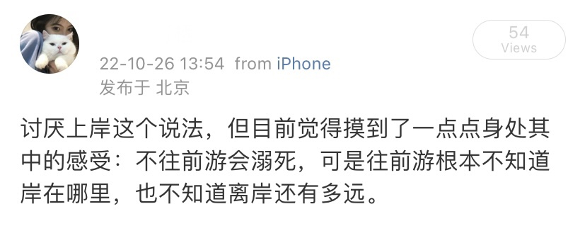

2022年的底色并不见得有多明快。上半年挣扎于人生道路的选择，下半年在无用功里忙碌。

一直觉得做选择的过程是残忍的。香草味和巧克力味的可爱多本来没有高下之分，但是当兜里只有三块钱的时候必须要选择一个而放弃另一个。走到每一个路口都会想是不是上一个路口不该这样选，兜里只有三块钱还想和老板娘还价问两个冰淇淋能不能便宜点，人就是这样贪心又矛盾的生物。纠结选哪个口味的过程很折磨人，努力讨价还价的过程也并不容易，但真正下定决心反倒只有短短一瞬。后来才知道可爱多出了双拼口味，但生活并没有给我一个两全之法。

学会接受失败是必修课。道理劝人容易，落到自己身上依然难捱。人人都说上岸。保研上岸、申请上岸、秋招上岸、考研上岸、考公上岸；努力上岸、祝你上岸、恭喜上岸、一定上岸。可究竟“岸”在哪里呢，有没有尽头呢？“岸”就像是驴子前面挂着的那根胡萝卜，诱人却永无止境，人或许穷其一生也找不到可以永远栖身的岸。西西弗斯永远在上岸，却永远上不了岸。

这一年于我也是崩塌与重建的一年。“家人健康平安”的愿望在2022年最后一个月被打破，太外婆永远留在了2022年的最后一天，她到底还是没有跨入这个新年。我自己也在这一年里逐渐成为医院的常客，自我感觉良好，倒是经常把爸妈和身边人都吓得不轻，需要认真地说一声抱歉与感谢。比以往更爱哭了，但在眼泪中收拾心情的能力有所提高，还是值得夸奖。药盒里多了一些新面孔，布洛芬这位老朋友也从未让我失望，新的一年里希望可以不用再请它们多多关照。

如果有一个“今年相处时间最久的人”排行榜，除了我自己以外，zsy将毫无悬念地荣登榜首。细数起来和zsy一起自习过的地点还真是超乎寻常，知岛、必胜客、麦当劳、肯德基、便利蜂、24h营业的牛肉面馆、泊星地、文史楼……不盘一下真没想到会有这么多奇怪的地方。遇见能轻松聊几个小时的人本就十分难得，更神奇的是呆在一起这么久了居然还是可以毫无压力地一聊三四个小时。这一年过得很不容易，但他总是会在我最需要的时候出现，作为讨论的伙伴、作为知心的朋友、作为最亲密的人。那天和zsy开玩笑说，没必要看我的年终总结，因为这些事你都在场。转眼两三百天匆匆而过，感谢他陪我走过这坎坷的一年。

2022年只有四个月在做实习，和身边人对比起来真是怠惰。在不喜欢的领域做着不喜欢的事情，做多久都不舒坦。是不是从选专业开始就走错了呢？我不知道。但临毕业之际回头再看，其实当初的选择，已经是在那时的环境下能够做出的最好的决定了。既然这样，那后悔也无从谈起，因为就算让我再次回到那个时间节点，我也没有办法做出更好的选择。

又到了令人纠结的结尾时刻。可是既然都拖到了正月十五，那就没必要把迈入新一年写得多么踌躇满志斗志昂扬了。总之，凑合过吧，如果可以的话，尽量别比2022更糟。

